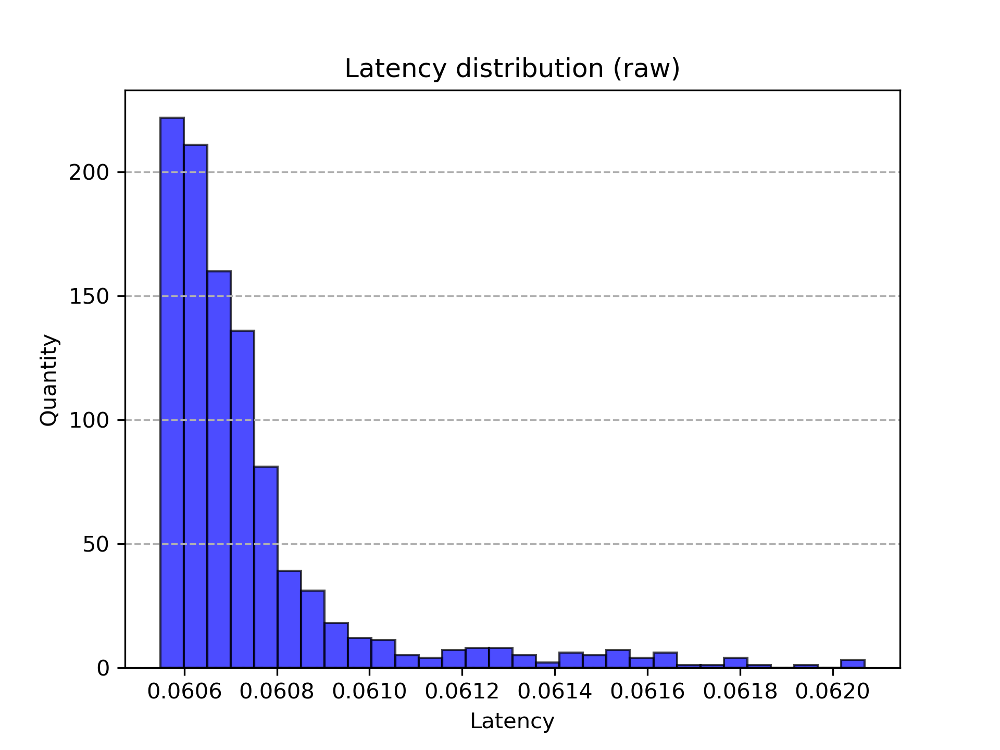
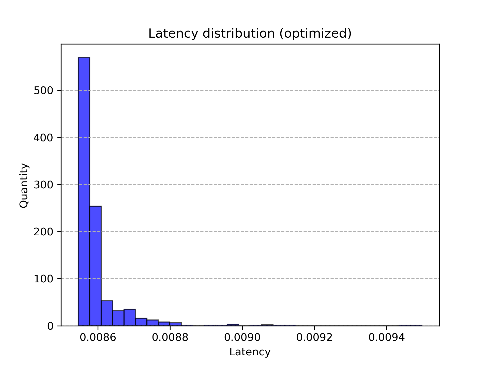

// TODO инструкции по сборке + характеристики пк. DONE
// Ссылки на godbolt

# Визуализация множества Мандельброта на плоскости. Оптимизация с использованием SIMD.
**Цели работы:**

1) Рассчитать точки множества Мандельброта на плоскости.

2) Оптимизировать вычисления с помощью instrinsic функций и сравнить производительность.
## Теоретическая справка
  **Множество Мандельброта** - множество точек на комплексной плоскости, для которых рекурсивная формула $z_{n+1}=z_n^2+z_0$ задает ограниченную последовательность.

  В силу невозможности расчета бесконечного количества точек, ограниченность последовательности будем определять с помощью сравнения расстояния от центра $n$-ой точки до начала координат $(0, 0)$ с радиусом окружности $R$.
  То есть если N элементов лежат в этой окружности, мы считаем, что последовательность сходится для точки.

  **Конвейерная обработка данных** - модель компьютерных вычислений, при которых выполнение команды делится на последовательность дискретных этапов таким образом, что несколько команд могут обрабатываться одновременно. 
  
  Этапы конвейера в современных процессора (одна из возможных реализаций):

  1. **Выбор PC**. Значение PC выбирается в зависимости от информации о состоянии, сохраненной предыдущей инструкцией.
  2. **Этап выборки**. Во время этого этапа работает аппаратный модуль памяти для инструкций: начиная с адреса, на который указывает PC (Program Counter) из памяти инструкций извлекается определенное количество байт, затем
  код инструкции проверяется на валидность (есть ли он в архитектуре). Значения байтов-спецификаторов регистров передаются дальше по конвейеру вместе с кодом инструкции. Далее прогнозируется PC следующей инструкции. Стоит отметить, что PC невозможно спрогнозировать,
  если команда - условный переход или ret, в таком случае на аппаратном уровне создается **bubble** - до конца обработки проблемой инструкции (**hazard**) приостанавливается работа верхних этапов конвейера.
  3. **Декодирование**. Определяется тип операции, операнды, вычисляются необходимые адреса в реальной памяти.
  4. **Этап выполнения**. На этапе выполнения включаются АЛУ (арифметико-логические устройства) процессора. После выполнения арифметических и логических операций выставляются флаги и проверяются условия переходов/перемещений,
  5. **Обращение в память и обратная запись**. В память записываются/читаются данные программы. Результаты записываются в регистры. Сохраняется информация о состоянии.

  **SIMD (Single Instrunction Multiple Data)** - принцип выполнения компьютерных вычислений, при котором независимые данные с одинаковым поток команд обрабатываются процессором параллельно. Это одна из реализаций параллелизма на уровне данных.
  **Instrinsic функции (интринсики)** - обертка для набора ассемблерных команд, доступная в языках высокого уровня (например,  C).
  
  Для визуализации будем использовать библиотеку SDL. ([Их сайт](https://www.libsdl.org/))

  Главная идея оптимизации: при вычислении цвета каждой точки (он зависит от номера члена последовательности, вышедшего за радиус окружности) используются независимые данные (цвет точки не зависит от ее соседей), поэтому появляется возможность использовать _mm интринсики, 
  позволяющие выполнять инструкции для независимых данных одновременно.

## Ход работы:
**1. Простая версия**

Простейшая версия расчетов предполагает последовательное вычисление каждого пикселя из массива. Вот пример алгоритма:

```cpp
for(int yPixels = 0; yPixels < ScreenY; yPixels++)
{
    float Y = ((float)(CenterY - yPixels)) * step;
    float y0 = Y;
    for(int xPixels = 0; xPixels < ScreenX; xPixels++)
    {
        float X = ((float)(xPixels - CenterX)) * step;
        Y = ((float)(CenterY - yPixels)) * step;
        float x0 = X;
        int Iterations = 0;
        for(; Iterations < ProbeNumber; Iterations++)
        {
            float xx = X*X;
            float yy = Y*Y;
            float xy = X*Y;

            if(xx + yy > BorderRadius)
            {
                break;
            }

            X = xx - yy + x0;
            Y = 2 * xy + y0;
        }
        PixelSet[yPixels * ScreenX + xPixels] = Iterations;
    }
}
```

***2. Версия с интринсиками***
```сpp
for(int yPixels = 0; yPixels < ScreenY; yPixels++)
{
    yInitial = _mm256_set1_ps((float)yPixels);
    yInitial = _mm256_sub_ps(CenterY_m256, yInitial);
    yInitial = _mm256_mul_ps(yInitial, step_m256);
    
    for(int xPixels = 0; xPixels < ScreenX; xPixels += 8)
    {
        xCurrent = _mm256_set1_ps((float)xPixels);
        xCurrent = _mm256_add_ps(xCurrent, ZeroToThreeConstants_m256);
        xCurrent = _mm256_sub_ps(xCurrent, CenterX_m256);
        xCurrent = _mm256_mul_ps(xCurrent, step_m256);

        yCurrent = yInitial;
        xInitial = xCurrent;

        __m256i ProbeQuantity = {};
        for(int i = 0; i < ProbeNumber; i++)
        {
            // x^2
            xSquare = _mm256_mul_ps(xCurrent, xCurrent);
            // y^2
            ySquare = _mm256_mul_ps(yCurrent, yCurrent);
            // x * y
            xy = _mm256_mul_ps(xCurrent, yCurrent);

            // x^2 + y^2 < radius
            __m256 Distance = _mm256_add_ps(xSquare, ySquare);
            __m256 CmpResult = _mm256_cmp_ps(Distance, BorderRadius_m256, _CMP_LT_OS); // почленно сравнивает элементы Distance с радиусом окружности. При true записывает 0xFFFF в соотв. байты CmpResult.
            int mask = _mm256_movemask_ps(CmpResult); // Выгружаем маску в int переменную, чтобы проверить на ноль

            if(mask == 0) // если маска равна нулю, все точки вышли за радиус
            {
                break;
            }

            // Увеличиваем n члена последовательности для точек, которые еще не вышли из радиуса с помощью маски
            ProbeQuantity = _mm256_sub_epi32(ProbeQuantity, *((__m256i*)(&CmpResult)));

            // x_n+1 = x^2_n - y^2_n + x_0
            xCurrent = _mm256_sub_ps(xSquare, ySquare);
            xCurrent = _mm256_add_ps(xCurrent, xInitial);

            // y_n+1 = 2 * x_n * y_n + y_0
            xy = _mm256_mul_ps(xy, Const2_m256);
            yCurrent = _mm256_add_ps(xy, yInitial);
        }

        // Копирование значений в массив
        memcpy(PixelSet + yPixels * ScreenX + xPixels, &ProbeQuantity, sizeof(int) * 8);
    }
}
```
**3. Версия на массивах**
В этой версии мы пытаемся воспользоваться оптимизациями компилятора, "намекнув" ему на использование SIMD команд. **ВАЖНО:** эта версия корректно работала только с clang-ом.
```cpp
   #define ARRAY_CYCLE(statement) for(int i = 0; i < 4; i++) statement;
   for(int yPixels = 0; yPixels < ScreenY; yPixels++)
   {
       float y0 = ((float)(CenterY - yPixels)) * step;
       
       for(int xPixels = 0; xPixels < ScreenX; xPixels += 4)
       {
           ARRAY_CYCLE(X[i] = ((float)(xPixels - CenterX + i)) * step)
           ARRAY_CYCLE(Y[i] = y0)
           ARRAY_CYCLE(x0[i] = X[i])

           for(int j = 0; j < ProbeNumber; j++)
           {
               int Probes[4] = {};

               ARRAY_CYCLE(xx[i] = X[i] * X[i])
               ARRAY_CYCLE(yy[i] = Y[i] * Y[i])
               ARRAY_CYCLE(xy[i] = X[i] * Y[i])
               ARRAY_CYCLE(mask[i] = ((xx[i] + yy[i]) < BorderRadius))
               ARRAY_CYCLE(Probes[i] += mask[i])
               int m = 0;
               ARRAY_CYCLE(m += mask[i])
               if(m == 0)
               {
                   break;
               }
       
               ARRAY_CYCLE(X[i] = xx[i] - yy[i] + x0[i])
               ARRAY_CYCLE(Y[i] = 2 * xy[i] + y0)
           }
       }
   }
```
**4. Сравнение производительности**

**Характеристики ПК:** 
Процессор: Intel(R) Pentium(R) Gold 7505 @ 2.00GHz (на время тестирования была зафиксирована частота 3.00GHz)
ОЗУ: 7821040 KiB, частота 3200MHz

**Инструкция по сборке:** Для версии 1 и 2 можно использовать любой из следующих компиляторов: gcc, g++, clang. Версию 3 необходимо компилировать только с clang. Необходим флаг линковщика -lSDL2 для работы SDL (Инструкция по установке библиотеки есть в их [репозитории](https://github.com/libsdl-org/SDL)). Флаги компилятора: -mavx2 для поддержки интринсиков, работающих с 256 битами, -O2 -ffast-math -flto для максимального ускорения.


Latency - задержку будем считать с помощью функции _rdtsc(), возвращающей количество тактов, прошедшее с начала работы процессора. Разделив разность начального и конечного значения, возвращаемого _rdtsc(), на зафиксированную частоту процессора, получим задержку в секундах. **ВАЖНО:** даже при фиксированной с помощью cpupower частоте процессора, время

Код тестировщика:


```cpp
unsigned long long start = 0;
unsigned long long end = 0;

for(int i = 0; i < TestNumber; i++)
{
    start = _rdtsc();
    MandelbrotRaw(PixelSet, ScreenX, ScreenY, ProbeNumber, step, CenterX, CenterY, BorderRadius);
    end = _rdtsc();

    unsigned long long DeltaClocks = end - start;
    LatencyDataArrayRaw[i] = (double)(DeltaClocks) / (double)CPUfrequency;
    ClocksRaw += DeltaClocks;

    start = _rdtsc();
    MandelbrotOptimized(PixelSet, ScreenX, ScreenY, ProbeNumber, step, CenterX, CenterY, BorderRadius);
    end = _rdtsc();

    DeltaClocks = end - start;
    LatencyDataArrayOptimized[i] = (double)(DeltaClocks) / (double)CPUfrequency;
    ClocksOptimized += DeltaClocks; 
}
```
Результаты программа сохранит в файл data.dat, краткую сводку о тестировании в info.txt, графики в histOptimized.py и histRaw.py (их нужно будет запустить, чтобы получить png графики). 

Частоту процессора фиксируем с помощью cpupower (пример для юбунты):
```
sudo spupower frequency-set -u 3.0 Ghz
sudo spupower frequency-set -u 3.0 Ghz
```

Получаем:
```
01:35:31
CPU frequency = 3000000000
Number of tests = 1000
Short summary:
Raw latency = 60.7409; average raw latency = 0.0607409
Optimized latency = 8.5966; average optimized latency = 0.0085966
Relative Performance increase: 7.06139
```

Гистограммы: 

Посчитаем случайную погрешность: $\sigma = \sqrt{\frac{\sum x_{m}^2-x_i^2}{N(N-1)}}$



$\sigma_{raw}=1\cdot 10^{-5}$

$\sigma_{opt}=9\cdot 10^{-5}$

Значения задержки:

$L_{Raw}=(0.06074\pm0.00009)$ с

$L_{Raw}=(0.00860\pm0.00001)$ с

Теперь посмотрим, как зависит прирост производительности от количества рассматриваемых членов последовательности (будем выполнять по 200 тестов на частоте процессора 3GHz):


## Выводы
С помощью архитектурных оптимизаций удалось ускорить вычисления в 7 раз.
