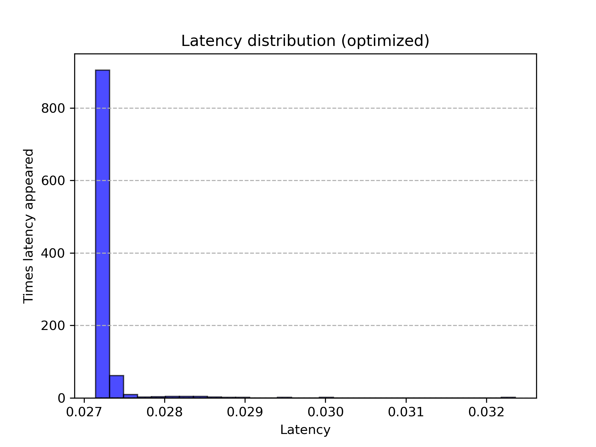
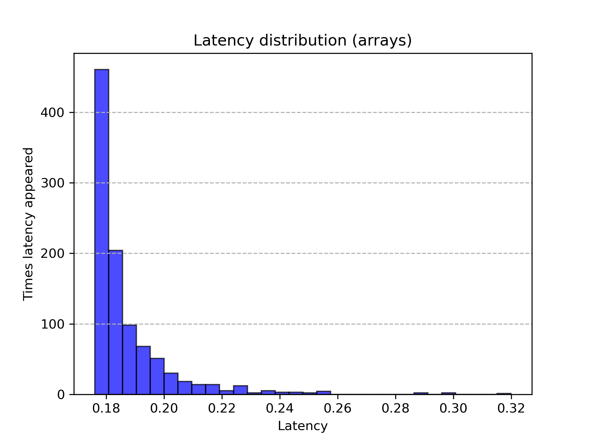
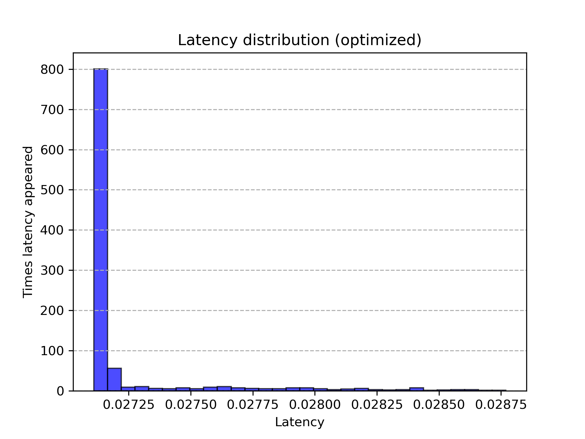

# Визуализация множества Мандельброта на плоскости. Оптимизация с использованием SIMD.
**Цели работы:**

1) Рассчитать точки множества Мандельброта на плоскости.

2) Оптимизировать вычисления с помощью instrinsic функций и сравнить производительность.
## Теоретическая справка
  **Множество Мандельброта** - множество точек на комплексной плоскости, для которых рекурсивная формула $z_{n+1}=z_n^2+z_0$ задает ограниченную последовательность.

  В силу невозможности расчета бесконечного количества точек, ограниченность последовательности будем определять с помощью сравнения расстояния от центра $n$-ой точки до начала координат $(0, 0)$ с радиусом окружности $R$.
  То есть если N элементов лежат в этой окружности, мы считаем, что последовательность сходится для точки.

  **Конвейерная обработка данных** - модель компьютерных вычислений, при которых выполнение команды делится на последовательность дискретных этапов таким образом, что несколько команд могут обрабатываться одновременно. 
  
  Этапы конвейера в современных процессора (одна из возможных реализаций):

  1. **Выбор PC**. Значение PC выбирается в зависимости от информации о состоянии, сохраненной предыдущей инструкцией.
  2. **Этап выборки**. Во время этого этапа работает аппаратный модуль памяти для инструкций: начиная с адреса, на который указывает PC (Program Counter) из памяти инструкций извлекается определенное количество байт, затем
  код инструкции проверяется на валидность (есть ли он в архитектуре). Значения байтов-спецификаторов регистров передаются дальше по конвейеру вместе с кодом инструкции. Далее прогнозируется PC следующей инструкции. Стоит отметить, что PC невозможно спрогнозировать,
  если команда - условный переход или ret, в таком случае на аппаратном уровне создается **bubble** - до конца обработки проблемой инструкции (**hazard**) приостанавливается работа верхних этапов конвейера.
  3. **Декодирование**. Определяется тип операции, операнды, вычисляются необходимые адреса в реальной памяти.
  4. **Этап выполнения**. На этапе выполнения включаются АЛУ (арифметико-логические устройства) процессора. После выполнения арифметических и логических операций выставляются флаги и проверяются условия переходов/перемещений,
  5. **Обращение в память и обратная запись**. В память записываются/читаются данные программы. Результаты записываются в регистры. Сохраняется информация о состоянии.

  **SIMD (Single Instrunction Multiple Data)** - принцип выполнения компьютерных вычислений, при котором независимые данные с одинаковым поток команд обрабатываются процессором параллельно. Это одна из реализаций параллелизма на уровне данных.
  **Instrinsic функции (интринсики)** - обертка для набора ассемблерных команд, доступная в языках высокого уровня (например,  C).
  
  Для визуализации будем использовать библиотеку SDL. ([Их сайт](https://www.libsdl.org/))

  Главная идея оптимизации: при вычислении цвета каждой точки (он зависит от номера члена последовательности, вышедшего за радиус окружности) используются независимые данные (цвет точки не зависит от ее соседей), поэтому появляется возможность использовать _mm интринсики, 
  позволяющие выполнять инструкции для независимых данных одновременно.

## Ход работы:
**1. Простая версия**

Простейшая версия расчетов предполагает последовательное вычисление каждого пикселя из массива. Вот пример алгоритма:

```cpp
for(int yPixels = 0; yPixels < ScreenY; yPixels++)
{
    float Y = ((float)(CenterY - yPixels)) * step;
    float y0 = Y;
    for(int xPixels = 0; xPixels < ScreenX; xPixels++)
    {
        float X = ((float)(xPixels - CenterX)) * step;
        Y = ((float)(CenterY - yPixels)) * step;
        float x0 = X;
        int Iterations = 0;
        for(; Iterations < ProbeNumber; Iterations++)
        {
            float xx = X*X;
            float yy = Y*Y;
            float xy = X*Y;

            if(xx + yy > BorderRadius)
            {
                break;
            }

            X = xx - yy + x0;
            Y = 2 * xy + y0;
        }
        PixelSet[yPixels * ScreenX + xPixels] = Iterations;
    }
}
```
[Ссылка на скомпилированный код](https://godbolt.org/#z:OYLghAFBqd5QCxAYwPYBMCmBRdBLAF1QCcAaPECAMzwBtMA7AQwFtMQByARg9KtQYEAysib0QXACx8BBAKoBnTAAUAHpwAMvAFYTStJg1AB9U8lJL6yAngGVG6AMKpaAVxYMQANlIOAMngMmABy7gBGmMQgAKwapAAOqAqEtgzObh7eCUkpAgFBoSwRUbEWmFY2AkIETMQE6e6ePpaY1qnVtQT5IeGRMXEKNXUNmc1DXYE9RX2xAJQWqK7EyOwcAKQATADMgchuWADUa1uOg%2Bi0eGEAdAjH2GsaAIKbOwx7rofHjjZsN3cPz22u32mCOJ0GxECwD%2BW3uTxewI%2BoK%2BqgAHF5AgRIQwYXDAa93p9wQR8KhcQCKUC3iCwY5MCwWJjseT4VTCciTqoGUzAiznk9MQcWExAhBZhSAOwAIQBBzlR22WBoQQOjwASmrHgBNYyOLWOPzYCCDJgEemMAizA78YgQQV4MEAEQOGmOUoODq%2BB0kbo9mxlGylVpNZrYgjdsvlgpExEwjC1ToOqI0rq2Mqe8o9ggOMbjDAAGonk6n049M4K6YJIgnjs7c/GDgB6A4bCMZqPZytm4iF2s55CxxiF5uttORuVUWioU0HQaYeKJjRXFNbKhtsvygBuLlNdFBguUeFU5SEmAIa2iUvrBYOACp%2B4OGFqL86%2B2tpe/Hevy9nlMRUBEhTFImkgpt%2B8qTtOBAHFKJBYMQapMPgrgKImWzgXK47WiQdrZgAnoex60KhfYlgcBFHuUJEnA%2BebPmm5GEVR/r%2BuK7aYR%2B7GZtaU4zjWWzOlAkGmrMEBdtWBwALSMZRxGzFa95zvEGHccJ0F4Roib0aW3Hyo2zYACoAPKOkZBwAGKuG8lQMKhRBZgOmBMEoByxkhTBhHQhB4UcXGZjauHQaoTHEYuvrBbJ1GOLRQ7hSFCgsYGbEbrp746bpvkpRlE68dBvYCQcQm5aJEVEah0niT28l3rOZrKWOfkZfxgnUMVYkWhJ0kUWV1WKXVKnZWpByqJpfb5gNGWCgAkt2u4CNRzollhg04b6M2RHNtm0gcf4AVMxRrbNNkJYGrHLRlaXndlOVQcNqiJvmt7jQ1WXXRBuXkT5fZare2lXddQ2qF9BWPX98KNW9eBUBAqj3f6n1gtgMFwZEiHIQoyVvalnGvVjmZhG5ADWE1vZ%2BFIQ9d%2BXOrDUkI/DI0k9dzUtjVQMKu6GmM5mZMU5mIWnuel7dVRNXXr2gbDfFL6JutxCbQlL3ZTzWXK5msYEEsDAuuun4cPMtCcNEvCeBwWikKgnDRQoizLMi2w8KQBCaHr8yEyAWzRFcXgAJySKiGwbKiQeB1sWyovonCSMbzvm5wvAKCAcRO6beukHAsBIGgLDxHuZAUBAWc5/QUTIHshjABsGhcHENC0N2CcQGEMeecwxB4ZwDst7UeFGWE2itMnDtZ2GBBGQwtDtynpBYGErjAI4YjER3vBYMKRjiFP%2BCxm0m6YAnU%2BYMeyCuGay/kFWBtTxcBPd84WAx1ieAsGfu/EGESSYI69LlxcRjO/Mk4mDAAUAANTwJgAA7kZeIjAz78EECIMQ7ApAyEEIoFQ6gp66C4PocuIBTDGHMNfBOkB5ioHiMdTgklhSblUBsKSRkNi8FQK/SEWASFijKBUVI9gGBOBcI0PQ/hJhAT6DgxIyQbIjE8OInINluiiKiDglobQqjjGkXoFRNkOh1AUb0JRFh1ECMyMo8YejphKPmNbJYKwJD60NtHKeFsODDXRJJLwkgDhlyMC2JcXBlyFVwIQEgCothcFmLwZOWh5KkDdpIK4WwNDRC4BKCUXB0lpK8F4DYEcOBR1ICbM2zj46J0dv/NOMBEAoFQNnXO5BKCF1zigYAUgcm13rpQJuU8u5tzPj0nufcB5n2HhaMeE8Y4zzngvWgS9uAr2/uvVYZst4DzwLvfeZtD6tBPqsB2mJygx2vnLNud8lmRMhM/OZpBX7vyUF/NewBf6gBTgAgwwCwGQOgbAq58DhCiHECg356C1Ax10Dkgwf8CFEMuBwshFDUj72oUwWh9DJJGS2Mw1heB2HwCseUVZdgIAOA0Tg4RBR9F6AkbkNIxiZHZEkakcxxRNH4tUQwHR9RaUsu4WozoTKxGGM6CSwVuiREUvCQsGxyD7EcCNgUmOzjXFeHcZ44ApcDhSCuPQiAQSiDEFCeEyJ/9XYgErrk/JhTmFxwsKUqJqd05VMacXepBcalFz6MgFpkg2l0A6Y3ZugRu59MDW3Xu/drDDJqSPMZk9lmYFnvPRe%2B8Harx/mc6eeBt42HWTHLZx9T5XP2ZfM2Rzb4YHTY/S5Dsbkf3uT/KE5TAHvPAVAmBJsHa/MQQC6QQKlAgqwe7XBkKzD6Bhbi828L5pUJoXQhhTDzZYpxaQrhBLPBEr4cKsl%2B0BVUqkVy2RDK8hiosdy1dHLhVaPaGY49zLTFCv3SKiY5KT0SusbbOxuS5WWtji4tEyqPEHDVcgDV8TtW6pCS8Q1ZSXkmrNZfC1CrrUJyTuUh1EBM5urqfnJ1HqvU%2BrrpEBuXSzb9ODa3AZ4bB68BGYIGNEz41TKTWfVNiyJmZtWTmg%2BR8dlnyLYcy4xy8KnIfhcl%2BkRbmfwWY8htLy%2BBvNAS2r57beCdv%2BcgntshgWYLNroaQEKTAjuIeO8hlCOBIpRQwjFC7IhsL3uOy9hLiUPq3YoylcjUjCt3Yym9AqHPsqMRkOlfmOX8oMSaYYD7wtPu3ZYyV76JWXy/Yh39biANAZA1qwJ%2BA9UGoidB6JsG4jwccUUpDtrjW5Pnd%2B4p%2BWXbXMIzwyQQA%3D%3D)

**2. Версия с интринсиками**

```cpp
for(int yPixels = 0; yPixels < ScreenY; yPixels++)
{
    yInitial = _mm256_set1_ps((float)yPixels);
    yInitial = _mm256_sub_ps(CenterY_m256, yInitial);
    yInitial = _mm256_mul_ps(yInitial, step_m256);
    
    for(int xPixels = 0; xPixels < ScreenX; xPixels += 8)
    {
        xCurrent = _mm256_set1_ps((float)xPixels);
        xCurrent = _mm256_add_ps(xCurrent, ZeroToThreeConstants_m256);
        xCurrent = _mm256_sub_ps(xCurrent, CenterX_m256);
        xCurrent = _mm256_mul_ps(xCurrent, step_m256);

        yCurrent = yInitial;
        xInitial = xCurrent;

        __m256i ProbeQuantity = {};
        for(int i = 0; i < ProbeNumber; i++)
        {
            // x^2
            xSquare = _mm256_mul_ps(xCurrent, xCurrent);
            // y^2
            ySquare = _mm256_mul_ps(yCurrent, yCurrent);
            // x * y
            xy = _mm256_mul_ps(xCurrent, yCurrent);

            // x^2 + y^2 < radius
            __m256 Distance = _mm256_add_ps(xSquare, ySquare);
            __m256 CmpResult = _mm256_cmp_ps(Distance, BorderRadius_m256, _CMP_LT_OS); // почленно сравнивает элементы Distance с радиусом окружности. При true записывает 0xFFFF в соотв. байты CmpResult.
            int mask = _mm256_movemask_ps(CmpResult); // Выгружаем маску в int переменную, чтобы проверить на ноль

            if(mask == 0) // если маска равна нулю, все точки вышли за радиус
            {
                break;
            }

            // Увеличиваем n члена последовательности для точек, которые еще не вышли из радиуса с помощью маски
            ProbeQuantity = _mm256_sub_epi32(ProbeQuantity, *((__m256i*)(&CmpResult)));

            // x_n+1 = x^2_n - y^2_n + x_0
            xCurrent = _mm256_sub_ps(xSquare, ySquare);
            xCurrent = _mm256_add_ps(xCurrent, xInitial);

            // y_n+1 = 2 * x_n * y_n + y_0
            xy = _mm256_mul_ps(xy, Const2_m256);
            yCurrent = _mm256_add_ps(xy, yInitial);
        }

        // Копирование значений в массив
        memcpy(PixelSet + yPixels * ScreenX + xPixels, &ProbeQuantity, sizeof(int) * 8);
    }
}
```

[Ссылка на скомпилированный код](https://godbolt.org/#z:OYLghAFBqd5QCxAYwPYBMCmBRdBLAF1QCcAaPECAMzwBtMA7AQwFtMQByARg9KtQYEAysib0QXACx8BBAKoBnTAAUAHpwAMvAFYTStJg1AB9U8lJL6yAngGVG6AMKpaAVxYMJADlIOAMngMmABy7gBGmMQgAKykAA6oCoS2DM5uHt7xickCAUGhLBFRsZaY1ilCBEzEBGnunlw%2BpeUCldUEeSHhkTEWVTV1GY197Z0FRTEAlBaorsTI7BwApABMAMyByG5YANRLa44KBOi0eGEAdAj72EsaAIKrGwxbrrv7jjZsl9e3D%2Bub20wewOR2IgWA3zWN3ujwBryB71UXgAbIECGCGJDoX8ni83iDjrYsb8Sf9noDgY5MCwWGiMcSYWS8QiDqoaXTAgyHvc0TsWExAhBJiSAOwAIV%2BOylO15ImImEYAE1gQARHZeDQafYS%2B7SmWCHZyhUMAAaqvVmu1kulvKpgkiyv2aqNSp2AHodisrbqbQa7QRImanYbkPLGGaPV61jq7nqqLRUEwCDsjpg4uaNOdNWsqN7Y77k8o8KpMLQhJgCEtomKXaadgAqENhhiKqtq4NLcWdlV5vW85TEVARcaRc2SS3R61S%2BOJ5NikhYYgAJSY%2BFcCnNa170qnO1MLBW0WRO1UQgAjq5qiz212RT3Jz6pfvD8eAJ7ny/y82diV37dP4wDyPE9X2/W97xjPVn2A1QAEkGGSMQwN/CDd2gt94MQ2hkO7f890Al8T0cOZ5QNDtwLw9CdlfYjiFI5NyJQvM0II4D/UDVjj2DQCgORYwlAILhjDiBQoBnJNJnY4gTWFB98wA3idikxVOPNHiX34ishJEsSEwk5TZMg6UqNTOJVO4mkNIE7TRNMwySUffDFOcBgjhWcy1jVdSj00wThNElZ7Mcqj52IRcVzXBQPK8yyfOs/yIFC8LVzwdcgvkpzCIALUiVAABV8oQMMXKOQwCCixSLN43yEpFUgdmRerYh2aQdjWeqVnqrh6o0dLd34YgIF5V8ixLWgN2DLVo2o0bSwmg4m2NVtppG4s5tWCUVjFYVHJ/Xc9VfTCbCQqqrK0hLqD0ghJlWsaFHSvUDqOvATs8vdYr4hRXDCBLlM4%2BrDoQ47aAex6pUBrC1I%2BwDXFoBKIeB%2BrTM40Gwf26UBqGg1VFm8aM21E9cfmxxFvDAmcbWvGNuDLwdoyvU9scsGpVUWj6Kh6r4p0y7Z0mCm7tR5mWbZxgGLe7y%2BNXdAEtZkjRfqnLBwKvKioVEqqkECqX0FoXZbo0WOas76ZZFwR6qkk0Ubw3XTbFmLqpYWGTbls2UwDMzeL6pnmZol27eo56xGt5m4KBl7sODPX6OY72wfQvAdgHIdMAARUvQRCFAxjcLkoW4xILHkwTyaCeLhak%2BHbpiFL6mtrpvOdy7WO87dD1VCrbAvWb3WPyvQ2fMduGdKj%2BWiL9nWG/dD1Xw7rv6cn98Lz706B6dnTff112N/oieG9bk8G2o9GG9ULPxehwfnc3ggAdtr3573tvZ72Laj%2BiTvKR2YgUvXY%2B86olUeBSrPGvO9aqUsZa93lADKBmBd7/1Uo4FgcQlyYC%2BrQf2EtjDIGQQlQBwCFj1SSpECKqUtZHnqsYRwABZZQxg/B5WMAAeSEPAoWvJ%2BQKAANb9z4iwVAAA3akTBuG/WQag9B10Y4PzzngKgEBOE8KdJNeuk8GZNxkWosI8omBcODg3XCMJu7M33vBUMmARHgkToOCIacyqZx2EwZAaAwpWKIHyERejjFgwrqndONgCBn3tkbH6aY8BrBWBAXxdiM6BPqvWKA8d6yTAgKsZESCUFoNhtdSY981F6n3qoYwDANpcHNO3d%2B7kGA7AALRv07sUl%2BYoTzGC1N4x6I8yLn05sbYesCYFL3lGwkOtteHGAgcPW29VQ5YTyfkqU%2B9XzFNKeaFYh8inVMbEs6pG1qKtL/rrIJYCNKX2Hq%2Bc2Ag3JW1zvM6ioyV6S3QNLM5ANA4g30Y9QxmjpT72cHEV8Vjgg7AEWIVwaCdjuNxuWSs7TW4JIgEklJUKKxNJmpTDcjZaxBlfvzOauTzTRP8ZnD5eo2AsGQP8qJlNoWotunNQ%2BWLUW4vGvVNJhL7FxJTHgAAXpgVA8i0STEPrTAm%2B88pMJVEwxxpxgBBHQNKhMyAdiSuCNiIWXz1E9kcnEDEBB5GrC9IedAVZHAlJWJ1RO1KKxVjFFwNsgt5QEDmNUqazS9gwjvBwaYtBODRF4J4DgWhSCoE4CTBQsx5gInWDwUgBBNBeumFwkAh5zjImRCKaIIpJAAE41iNA1FwDQdUfUcEkP6%2BNwbOC8AUCADQsb43TDgLAJAaBkF0EiOQSgra4jtqiMgYAUhOo0AwZEGtEAwgVrCIEaor5OAxqncwYgr4mFhG0GUON3BeCtrYIIJhDBaCzsDbwLAYRXDAEcGIcac7j3CKMOII9pB8DynKEImtD7MAlmQK4AM17yD2hLUG042iZ3OCwBW9EeAWC/qEcQMIiRMAqlvcAU4RgG18AMMABQAA1PAmAADuTC4iMF/fwQQIgxDsCkDIQQigVDqAfbobqBhUOmGwfoM4NbIDTFQHEGwlzOA1P5AI1QayalMJWLwQRkQwRYE40KCwpZ10pHsAwJwLh6h6H8IELohQejdQSEkPjqR1NDCyIZlIYwq56GaEZtoAwTMNAU1YWz/QOjaZHFEbqpV7PpEc95tz%2BQrNcGmOGuYCwJDet9eWh9IaOAnhRDU5EkgdjAGcTsKQ5w1kQFwIQEgL882TF4BurQuTSBJoy2sCJkhDwaGRF4LgXBs1eFzfoTgZbSABqDbF6ttb61HsbTARAKBUBtvoGQCgEBu29pQAO6rfA6ABmIGOidD6F0zt/WtpdK613WF/du0We6D0VpPWei9tAr2bsfUh%2B9Qan1KdfRWj9ZRv2LBjWiUsFagPfyXaBxYQaINQcuzBuDShEP8jveCND8YmCYZw/hwjxHLukeEKIcQVHke0bUBW3QnVmMmDMOxsIcnuO8ZSG%2BwTTBhOiaYWsSTMGZNoPgCFxTLRPAQAcIMRzWnAu6c82ZnIxnfN6AMwLyzvPrMs5c%2B0TnEvnMVFc2LiYXnXMy%2BV6MdzQWQsRvC8F1rHA/UdYrbF%2BLyJEvJdS0qjLWWctEGIPl4LRWG2JuTXWkt7XOuSarRYXrxWvWkCbUNqbY3O2TZGz2sbKAtiGGACsDQhb5sjqW5QFbQbNuHvndOrbq7117ZGzuggh3D23cwKe89l630xqwOD5Df3j14GfTYB777P0vd/e9gDvAvsgYwLX2NYJAcxuB/BsH0eUOgH6%2BhmH2HcMEaIwGmNyPyNo%2BkBjpQWOGMgHanjkArHzBAeJ8G0n/GOAU6p7U8TdPpN4Fk0zpzSm7Ds9U6r3wqnFd6f50Z5/IujNv75zZ%2BX0uDmsu9%2BDAdmAWOmSuIwPmGmauNQv%2BEWMwYWlGkW%2Bu0WXWnAJuZuOwUeRgnomYXAWYOw2W%2BAtu9uhWfWJWzuseeu7uRuXuNadavuA28AEALaYevaIeQePQzieOse8ew6i2y2k6me6evAae22Oel2%2B2u6%2B6ReN6peZ2F2le12ved2L6jOzez2P6l27en2Zw32NEPe4G/e0GkQIOCG12kOE%2B0OsOM%2BCO8%2BvAi%2BqOlGK%2BsgmO9GQaug0g2%2Bu%2BhOB%2BPGRm5OQmIm5%2BtOwa9O1%2BjOXGd%2BrOKmamQu3U3OEB7%2B3%2BKQX%2B2QP%2BGu4uXmkuAB0Bpm/%2BrQCuWRkB/mz%2B/m8BuuoWkaCBJaBuHulacWSIpuSW2BeOeB5wBBGgRBNueWjwDuFBCaZWLuNBaBnuHAPWjBTueuEmhuMWXuTB0wMGSQdgkgQAA%3D%3D%3D)

**3. Версия на массивах**
В этой версии мы пытаемся воспользоваться оптимизациями компилятора, "намекнув" ему на использование SIMD команд. **ВАЖНО:** эта версия корректно работала только с clang-ом.
```cpp
   #define ARRAY_CYCLE(statement) for(int i = 0; i < 4; i++) statement;
   for(int yPixels = 0; yPixels < ScreenY; yPixels++)
   {
       float y0 = ((float)(CenterY - yPixels)) * step;
       
       for(int xPixels = 0; xPixels < ScreenX; xPixels += 4)
       {
           ARRAY_CYCLE(X[i] = ((float)(xPixels - CenterX + i)) * step)
           ARRAY_CYCLE(Y[i] = y0)
           ARRAY_CYCLE(x0[i] = X[i])

           for(int j = 0; j < ProbeNumber; j++)
           {
               int Probes[4] = {};

               ARRAY_CYCLE(xx[i] = X[i] * X[i])
               ARRAY_CYCLE(yy[i] = Y[i] * Y[i])
               ARRAY_CYCLE(xy[i] = X[i] * Y[i])
               ARRAY_CYCLE(mask[i] = ((xx[i] + yy[i]) < BorderRadius))
               ARRAY_CYCLE(Probes[i] += mask[i])
               int m = 0;
               ARRAY_CYCLE(m += mask[i])
               if(m == 0)
               {
                   break;
               }
       
               ARRAY_CYCLE(X[i] = xx[i] - yy[i] + x0[i])
               ARRAY_CYCLE(Y[i] = 2 * xy[i] + y0)
           }
       }
   }
```
[Ссылка на скомпилированный код](https://godbolt.org/#z:OYLghAFBqd5QCxAYwPYBMCmBRdBLAF1QCcAaPECAMzwBtMA7AQwFtMQByARg9KtQYEAysib0QXACx8BBAKoBnTAAUAHpwAMvAFYTStJg1AB9U8lJL6yAngGVG6AMKpaAVxYMQAZi6kHAGTwGTAA5dwAjTGIQADYvUgAHVAVCWwZnNw9vXySUmwFA4LCWSOi4i0wrfIYhAiZiAgz3Tx8KqrTa%2BoJC0Iio2PiFOoamrNahrp7i0oGASgtUV2Jkdg4AUgAmLyDkNywAajWvRyH0WjxwgDoEI%2Bw1jQBBTe2GXdcDo8cbNmvb%2B6etjs9phDschsQgsBfl47o9nkD3iDPqoABwxIIECEMaGwgEvN4fMEEfCoHH/cmA17A0GOTAsFgYrFkuGUglI46qemMoLMp6PDH7FhMIIQWbkgDsACF/vtZYctlgaMF9g8AEqqh4ATWMjk1jn82AgEwIdMYBFm%2B34xAgArwoIAIvsNEdJfs7Z99pIXW7NtKNpKLcbTYIXeTHnK3YJ9iJiJhGJqHfsURpnV5peG5QKY3GGAANRPJ1Pph4RgW0wRRBNHR3Z%2BP7AD0%2Bw2oYzsrLZqi%2Ber0eQscY%2BcbzbTMrlVFoqCYBH2Q0wCUTGkuKa8VBbJczUeUeFUlSEmAIawArJLa3n9gAqHt9hiaw%2BO7trKUP%2B2r0sb4ioSLTKKJyQpl%2Bj8dJ32SUSCwYhVSYfBXAURMvH/WUR1lMcJynXND0lL0DzvLw70fcVn2HVtLUAqdVGdI9MOw3DpXw%2BDiJQ/Ybwo29EwfGiCOLCNkKA1RVHQyjWLwjjEPooCAE8xP4lj7yEujuNIyTmKwwT2LogUhQUABrKTlJk1TCLXJCSBtKMxM3bdaBg7si32Myt0qKzjkvHMbzTWzzIc31fTFIi2JEriSNsjREygeTZggcsTWIBMAFp3PsyzZgtC8ZwSOiI380djIFVQPMs%2BdvVyhLHMcZz%2B0KvKrP9btJB8wyI0OR8iIauU1Q1bVdX1Q00KPPBpJw/ZQpI8KiosmC4sizt5VdPAkvPacTQSOqWpatqtR1PUDQgJjJT63SBrEjRlpWiM1o6zbDTI9C9qo/Yet229jpOtsoyUYA2CjbsT3zC87LG6b9lGzyDOe9cp2Ud9IgUHTbr82iQdBy1sqjbQCrc1GPQhj9ehKKJvW0Lz/Se56/LhMn6sRlV1XWzqtt467%2Bsde6bvm5nHsy0Gzo2rqIAkhn9sdHaWYvIX2eaxGudpy7FIegW7v5x0RYV4nKcli6IA07TesZwaIHp7XdP9WyZZui0PRA4gwIgqCFCSjnnrVnmsahhXpu7TXlftk71LRzjKda6nzp5lg3YGj2DftFXEbwKgNYdayo9B0mKf92VwljJhtIR1On3tr2Vsdra2bl/XZcdOK%2BYjgGrojxOHcD7mttFuWNnm1QTeko3DrrjLaPF1aG6liA8t3fcjzej6p19H05edzBodr9K5Vz3y%2B/qhIsQIWPNmbDYD3QQ9HAYHfSH2Ee93Qrh2ez/ZYwIJYGCdVcnw4eZaE4A9eE8DgtFIVBOFKgoRYywkRbB4KQAgmhX7zE0t4A8lwYgAE5JAog2BsFEGD0FeC8CifQnBJBfygX/TgvAFAgA0BAqB8w4CwCQGgFgCQ6BRHIJQehjD6DRGQLsQwwANgaC4BQmgtAopkIgOEIh4Qgj1DEpwcBkjmDEDEgAeXCNoTA1hZG8HoZPJRDBaAyJ/rwLA4RXDAEcGISymjSBYCFEYcQhjrF4FjNYPAAA3eeRDMDbmQK4E0ViMSVCIecdO0jnBYCIZiPALArHuOIOEZImB7R0h4ecIwVC%2BAGGAAoAAangTAAB3JRCRGBWP4IIEQYh2BSBkIIRQKh1AON0L4AwaTTDGHMMEshkB5ioASNUMhHAYpClcaoVuMUlEbF4KgWJEIsBdNFG0dR1R7AMCcC4ZoegAhBBxjMHIyRUgCFGJ4PZeQ0hTD6NEXwlglkdGGI0dZWQrmVBuQIToDRzm40uRYO5Ry9ATHedsr8lz5hAKWCsCQb8P6EIcf/DggM0QxRiJIfY3CjBNgXFwRcg1cCEBIPKHwsxeCQMMUlUgsDJCXC8BoA8XBxTii4Ay%2BlMQYgbDwRwAhpBv6/1haQ8hlCSWkBoYgFAqAGFMLIBQCAbDxUoGAFIVlQiRGUHEQ4%2BR0irFqsUSotRGjuBaNFTovRBjf7GNMeY2gli9XWOSXY1YJqnE3PcQM3%2BXj1G%2BNWOAgJ78HHBOIKEjAdqiUQmiVa2J8SlBJNscAVJoABVjiYFk3JBSiklKtWU4QohxDVPTXUtQRDdCspaSYMw%2BgLjzJ6X0tIAyhlMBGWMpRXgpkzLwHM%2BAILnkuLsBABwvzfBbKKBcvQuQDnpAeccxI%2BzqgfN2YsztNQfljr%2BR26obzuiAsHVchdmRx3/LXQOz5EKFhgqqZCjgn9OVENhfCmIiLkXAC4fsKQlxW4QBxUQYg%2BKuCEv5VoUlsC%2BFso5VyqZJCLB8uJb%2BwVMBhXSo4SwqVor2H9GQHKyQCq6BKrERIqRiiNU4eUaopZVjtFml0foohpqzEWIGeAmxKTA2OOcTYJ1njvHuv8RWb1v9fX%2BvCQ4yJIbwFhoSZGlJkJ0nxsTXkwpxTv7gPTRUrN0gc1KDzY07w%2BgeEgDaR0stba/6VoENW4Zoz9jjMmX/ZtrbumzuWd21Zva/CrOnf0E5I7HPDqneug9Tz2ivK3Rs3zLz52TG8zO3djnd0ueBUekBh7vXnuA8QuFqIb1Iv2Pe5Aj6KUvrfXi54X6iVUJgSAAD3qgOXtA2QihEHX5QfgBAOhiHxXwdg8h1D6HhFRFESq3%2BmqDFyPw9qojVqSOCDI8aoxmATFUYtTRqbUb7H2qY24jxDjXU%2BL8Var1QSLh%2BsUWEhjAmYlRHDYkm10bxNxsyTk6TKa5O8AU5mqpynZC5oab/XQ0gi3aZLZ0/TvT%2BmcBrXWszDam1RFmR4mz1y50rLWduzZzmwuuYnacw5i63Nef3eF5dtyuiRbx/50LOPUcRcx98knOzXMguAeCr9bLEuVZSwi9LmXsvPuxfgd9n7v21b/aVih5XoXcqq%2BB4rbKLNJZ5T%2B6BpBYkpDsJIIAA%3D%3D)

**4. Сравнение производительности**

**Характеристики ПК:** 
Процессор: Intel(R) Pentium(R) Gold 7505 @ 2.00GHz (на время тестирования была зафиксирована частота 3.00GHz)
ОЗУ: 7821040 KiB, частота 3200MHz. Ubuntu 24.04.

**Инструкция по сборке:** Для версии 1 и 2 можно использовать любой из следующих компиляторов: gcc, g++, clang. Версию 3 необходимо компилировать только с clang (это утверждение будет подтверждено далее). Необходим флаг линковщика -lSDL2 для работы SDL (Инструкция по установке библиотеки есть в их [репозитории](https://github.com/libsdl-org/SDL)). Флаги компилятора: -mavx2 для поддержки интринсиков, работающих с 256 битами, -O2 -ffast-math -flto для максимального ускорения.


Latency - задержку будем считать с помощью функции _rdtsc(), возвращающей количество тактов, прошедшее с начала работы процессора. Разделив разность начального и конечного значения, возвращаемого _rdtsc(), на зафиксированную частоту процессора, получим задержку в секундах. **ВАЖНО:** даже при фиксированной с помощью cpupower частоте процессора, рассчитанное  время может отличаться от реального, поэтому значения с гистограммы даются с точностью до множителя, намного более точной характеристикой было бы количество тактов, возвращаемое _rdtsc(), но оно не наглядно, поэтому на гистограммах приведена именно задержка.

Код тестировщика:


```cpp
    for(int i = 0; i < params.TestNumber; i++)
    {
        start = _rdtsc(); 
        MandelbrotNaive(PixelSet, params.ScreenX, params.ScreenY, params.ProbeNumber, params.step, params.CenterX, params.CenterY, params.BorderRadius);
        end = _rdtsc();

        unsigned long long DeltaClocks = end - start;
        LatencyDataArrayRaw[i] = (double)(DeltaClocks) / (double)params.CPUFrequency;
        ClocksRaw += DeltaClocks;

        start = _rdtsc();
        MandelbrotIntrinsics(PixelSet, params.ScreenX, params.ScreenY, params.ProbeNumber, params.step, params.CenterX, params.CenterY, params.BorderRadius);
        end = _rdtsc();

        DeltaClocks = end - start;
        LatencyDataArrayOptimized[i] = (double)(DeltaClocks) / (double)params.CPUFrequency;
        ClocksOptimized += DeltaClocks; 


        start = _rdtsc();
        MandelbrotArrays(PixelSet, params.ScreenX, params.ScreenY, params.ProbeNumber, params.step, params.CenterX, params.CenterY, params.BorderRadius);
        end = _rdtsc();

        DeltaClocks = end - start;
        LatencyDataArrayArrays[i] = (double)(DeltaClocks) / (double)params.CPUFrequency;
        ClocksArrays += DeltaClocks; 
    }
```
Результаты программа сохранит в файл data.dat, краткую сводку о тестировании в info.txt, графики в histOptimized.py и histRaw.py (их нужно будет запустить, чтобы получить png графики). 

Частоту процессора фиксируем с помощью cpupower (пример для Ubuntu):
```
sudo spupower frequency-set -u 3.0 Ghz
sudo spupower frequency-set -u 3.0 Ghz
```

Получаем (пример):
```
02:08:44
CPU frequency = 3000000000
Number of tests = 1000
Number of probes for each dot: 400
Short summary:
Naive latency = 196.692; average naive latency = 0.196692
Optimized latency = 27.1817; average optimized latency = 0.0271817
Relative Performance increase: 7.23618
Arrays latency: 60.2322
```

Теперь будем проводить тесты с clang, -O2, -O3.
**Версии компиляторов:** clang 18.1.3
 Случайная погрешность для всех случаев: $\sigma = \sqrt{\frac{\sum x_{m}^2-x_i^2}{N(N-1)}}$

**clang -O2:**


$\sigma_{nai}=1\cdot 10^{-5}$

$\sigma_{opt}=9\cdot 10^{-5}$

$\sigma_{arr}=2\cdot 10^{-5}$

Значения задержки (средние):

$L_{nai}=(0.19669\pm0.00009)$ с

$L_{opt}=(0.02718\pm0.00001)$ с

$L_{arr}=(0.06023\pm0.00002)$ с

**clang -O3:**


$L_{nai} = (0.19 \pm 0.02)$ с

$L_{opt} = (0.027 \pm 0.003)$ с

$L_{arr} = (0.0552\pm 0.008)$ с

**gcc -O2:**






$L_{nai} =  (0.20\pm 0.02)$ с

$L_{opt} = (0.027\pm 0.003)$ c

$L_{arr} = (0.05686 \pm 0.005)$ с

**gcc -O3:**





$L_{nai} =  (0.20\pm 0.02)$ с

$L_{opt} = (0.027\pm 0.003)$ c

$L_{arr} = (0.0811 \pm 0.009)$ с


Теперь посмотрим, как зависит прирост производительности от количества рассматриваемых членов последовательности (будем выполнять по 200 тестов на частоте процессора 3GHz):


Из графика следует выкинуть первые 3 точки, как выходящие за 3- $\sigma$, тогда мы получим ожидаемую линейную зависимость.
(сравнение проводилось только для наивной и интринсик-версии)
## Выводы
С помощью архитектурных оптимизаций удалось ускорить более чем в 7 раз. С включенным -O3 версия с массивами начала работать быстрее, но менее стабильно. В двух других тестах разница между -O2 и -O3 несущественна. Стоит отметить, что gcc в среднем замедляет работу версии на массивах из-за агрессивной развертки, из-за которой компилятор в некоторых местах не видит возможности использовать SIMD инструкции.
