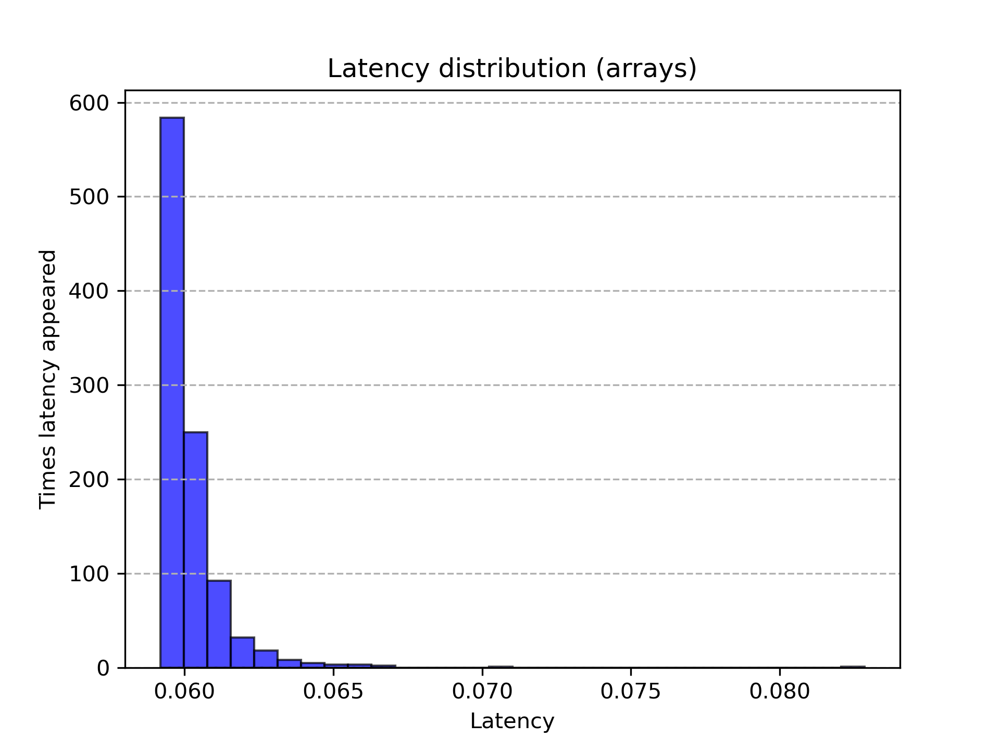

# Визуализация множества Мандельброта на плоскости. Оптимизация с использованием SIMD.
**Цели работы:**

1) Рассчитать точки множества Мандельброта на плоскости.

2) Оптимизировать вычисления с помощью instrinsic функций и сравнить производительность.
## Теоретическая справка
  **Множество Мандельброта** - множество точек на комплексной плоскости, для которых рекурсивная формула $z_{n+1}=z_n^2+z_0$ задает ограниченную последовательность.

  В силу невозможности расчета бесконечного количества точек, ограниченность последовательности будем определять с помощью сравнения расстояния от центра $n$-ой точки до начала координат $(0, 0)$ с радиусом окружности $R$.
  То есть если N элементов лежат в этой окружности, мы считаем, что последовательность сходится для точки.

  **Конвейерная обработка данных** - модель компьютерных вычислений, при которых выполнение команды делится на последовательность дискретных этапов таким образом, что несколько команд могут обрабатываться одновременно. 
  
  Этапы конвейера в современных процессора (одна из возможных реализаций):

  1. **Выбор PC**. Значение PC выбирается в зависимости от информации о состоянии, сохраненной предыдущей инструкцией.
  2. **Этап выборки**. Во время этого этапа работает аппаратный модуль памяти для инструкций: начиная с адреса, на который указывает PC (Program Counter) из памяти инструкций извлекается определенное количество байт, затем
  код инструкции проверяется на валидность (есть ли он в архитектуре). Значения байтов-спецификаторов регистров передаются дальше по конвейеру вместе с кодом инструкции. Далее прогнозируется PC следующей инструкции. Стоит отметить, что PC невозможно спрогнозировать,
  если команда - условный переход или ret, в таком случае на аппаратном уровне создается **bubble** - до конца обработки проблемой инструкции (**hazard**) приостанавливается работа верхних этапов конвейера.
  3. **Декодирование**. Определяется тип операции, операнды, вычисляются необходимые адреса в реальной памяти.
  4. **Этап выполнения**. На этапе выполнения включаются АЛУ (арифметико-логические устройства) процессора. После выполнения арифметических и логических операций выставляются флаги и проверяются условия переходов/перемещений,
  5. **Обращение в память и обратная запись**. В память записываются/читаются данные программы. Результаты записываются в регистры. Сохраняется информация о состоянии.

  **SIMD (Single Instrunction Multiple Data)** - принцип выполнения компьютерных вычислений, при котором независимые данные с одинаковым поток команд обрабатываются процессором параллельно. Это одна из реализаций параллелизма на уровне данных.
  **Instrinsic функции (интринсики)** - обертка для набора ассемблерных команд, доступная в языках высокого уровня (например,  C).
  
  Для визуализации будем использовать библиотеку SDL. ([Их сайт](https://www.libsdl.org/))

  Главная идея оптимизации: при вычислении цвета каждой точки (он зависит от номера члена последовательности, вышедшего за радиус окружности) используются независимые данные (цвет точки не зависит от ее соседей), поэтому появляется возможность использовать _mm интринсики, 
  позволяющие выполнять инструкции для независимых данных одновременно.

## Ход работы:
**1. Простая версия**

Простейшая версия расчетов предполагает последовательное вычисление каждого пикселя из массива. Вот пример алгоритма:

```cpp
for(int yPixels = 0; yPixels < ScreenY; yPixels++)
{
    float Y = ((float)(CenterY - yPixels)) * step;
    float y0 = Y;
    for(int xPixels = 0; xPixels < ScreenX; xPixels++)
    {
        float X = ((float)(xPixels - CenterX)) * step;
        Y = ((float)(CenterY - yPixels)) * step;
        float x0 = X;
        int Iterations = 0;
        for(; Iterations < ProbeNumber; Iterations++)
        {
            float xx = X*X;
            float yy = Y*Y;
            float xy = X*Y;

            if(xx + yy > BorderRadius)
            {
                break;
            }

            X = xx - yy + x0;
            Y = 2 * xy + y0;
        }
        PixelSet[yPixels * ScreenX + xPixels] = Iterations;
    }
}
```
[Ссылка на скомпилированный код](https://godbolt.org/#z:OYLghAFBqd5QCxAYwPYBMCmBRdBLAF1QCcAaPECAMzwBtMA7AQwFtMQByARg9KtQYEAysib0QXACx8BBAKoBnTAAUAHpwAMvAFYTStJg1AB9U8lJL6yAngGVG6AMKpaAVxYM9DgDJ4GmADl3ACNMYhBpAAdUBUJbBmc3Dz1o2JsBX38gllDw6UtMa3ihAiZiAkT3Ty4LTCt0hhKygkzAkLCIi1LyyuSahW6WvzacjskASgtUV2Jkdg4AUgAmAGY/ZDcsAGoFlccB9Fo8YIA6BF3sBY0AQWW1hg3Xbd3HGzYzi6vb1fXNzB29gNiH5gB8Vpcbl8/AQtiwmH4IOMvgsAOwAIS%2BWyxW2hWxExEwjAAmgCACJbAAcGg0uwxN2xOMEeOQBMYAA0yZTqbTMdjcY5GAQwiTduT8YSGCSAPRbJY8%2Bl8pkCwRhDmi5mshgcmVylZ064Mqi0VBMGEDTCRTkaE7UlZUeUGxUw5R4VR1ISYAgLACsaPF7K2ACoNRKiT7yerURiUaSHQzccpiKhQtlcpzJNy9bysUaTTC0SQsMQAEpMfCuBSclZx7HZrb8YgQXEATxdbtolfVNL1W1brrqnb2IeJtN7bYHywxSzRSIVWKjdcNxtNWxFK3JUFzpvGEGVQuIJIAtGP%2Bx3xuMg1tzZEawyc8uYc2NJyw1m53eG02mapxx2raOf1PQdHGHLUAN/BRJ0nWdHTvHZ0UXWt3zg%2B88y2NV1y2TcHx3QD20rY891Vc9L2vW8UKxNcN2oHDd0FYUtmPPt8JI4MyLfWCKPrB8tlUZ91TZciKNxABJfdTXiQdyW7fUuOxT9RzEsIJIEYCtkTZMRlyRTxIaSDp2gxC4IXZC5O4tDVFUTk2UDQSOLMj8eObZsX0DV9ZIc%2BSeNUFyBLch0jK4vAqAgSydmnXtfPBLYC2IItS3LBQYM82sENMlLggJJgAGshLM1FY0hdKuIw8kwqY3yIr4vK5Ko2VLx88K0V7GTAoZAq2uxX8PS9X1mIHS9/S1JreIg8NOSU4gVIYSD7JQjr3wWziCQIGYGC2VrIRjDhJloThvV4TwOC0UhUE4ECFGmWZ/juHhSAITQdsmbKQG9DR9E4SRDse07OF4BQQHeh7jp20g4FgJA0BYSI6DCchKChmH6HCZBgCkJY%2BDofcAYgYIfuCPwymbTg7oJ5hiGbAB5YJtEKYG7qhthBEphhaGJkHSCwYJXGARwxA7EneCwOEjHEDn8AJIoADdMABjnMDdZBXCFQXyBVPaOaOTKiecLAfoIYEWFVmXiGCGJMFJTAReAI4jEeyYjSYYAFAANTwTAAHdKciRhVf4QQRDEdgpBkQRFBUdQOd0GoDDt0xjHMLWAcgSZUEiPTOEPOEpdUJZeFQE3gSwZPEVqep4nsBgnBcKovCr1pUw6GpUjiARemqUgW4aBv2nCfo6jp4pBnbvQCiKAQmnKHvRj7rpmhH/pBmn3IJEmS6ZjmVePo4A7SCOk6zo4XiKQANkPE/JC2YBkGQLYpBOJYsNwQgSHClYuHGXhga0c9SBet7t5fT3j9Q%2B/1Ab3XtrtTgedgEc1ARAkGv8TaxDsJIIAA%3D)

***2. Версия с интринсиками***
```cpp
for(int yPixels = 0; yPixels < ScreenY; yPixels++)
{
    yInitial = _mm256_set1_ps((float)yPixels);
    yInitial = _mm256_sub_ps(CenterY_m256, yInitial);
    yInitial = _mm256_mul_ps(yInitial, step_m256);
    
    for(int xPixels = 0; xPixels < ScreenX; xPixels += 8)
    {
        xCurrent = _mm256_set1_ps((float)xPixels);
        xCurrent = _mm256_add_ps(xCurrent, ZeroToThreeConstants_m256);
        xCurrent = _mm256_sub_ps(xCurrent, CenterX_m256);
        xCurrent = _mm256_mul_ps(xCurrent, step_m256);

        yCurrent = yInitial;
        xInitial = xCurrent;

        __m256i ProbeQuantity = {};
        for(int i = 0; i < ProbeNumber; i++)
        {
            // x^2
            xSquare = _mm256_mul_ps(xCurrent, xCurrent);
            // y^2
            ySquare = _mm256_mul_ps(yCurrent, yCurrent);
            // x * y
            xy = _mm256_mul_ps(xCurrent, yCurrent);

            // x^2 + y^2 < radius
            __m256 Distance = _mm256_add_ps(xSquare, ySquare);
            __m256 CmpResult = _mm256_cmp_ps(Distance, BorderRadius_m256, _CMP_LT_OS); // почленно сравнивает элементы Distance с радиусом окружности. При true записывает 0xFFFF в соотв. байты CmpResult.
            int mask = _mm256_movemask_ps(CmpResult); // Выгружаем маску в int переменную, чтобы проверить на ноль

            if(mask == 0) // если маска равна нулю, все точки вышли за радиус
            {
                break;
            }

            // Увеличиваем n члена последовательности для точек, которые еще не вышли из радиуса с помощью маски
            ProbeQuantity = _mm256_sub_epi32(ProbeQuantity, *((__m256i*)(&CmpResult)));

            // x_n+1 = x^2_n - y^2_n + x_0
            xCurrent = _mm256_sub_ps(xSquare, ySquare);
            xCurrent = _mm256_add_ps(xCurrent, xInitial);

            // y_n+1 = 2 * x_n * y_n + y_0
            xy = _mm256_mul_ps(xy, Const2_m256);
            yCurrent = _mm256_add_ps(xy, yInitial);
        }

        // Копирование значений в массив
        memcpy(PixelSet + yPixels * ScreenX + xPixels, &ProbeQuantity, sizeof(int) * 8);
    }
}
```
[Ссылка на скомпилированный код](https://godbolt.org/#z:OYLghAFBqd5QCxAYwPYBMCmBRdBLAF1QCcAaPECAMzwBtMA7AQwFtMQByARg9KtQYEAysib0QXACx8BBAKoBnTAAUAHpwAMvAFYTStJg1AB9U8lJL6yAngGVG6AMKpaAVxYMQAJgBspBwAyeAyYAHLuAEaYxN5%2BAA6oCoS2DM5uHrGkCUk2AkEh4SxRMb4WmFa5DEIETMQEae6epZaY1inVtQT5YZHRmQo1dQ0ZzYNdwT1Ffb4AlBaorsTI7BwApF4AzMHIblgA1KsbjgPotHgRAHQIh9irGgCC61sMO677h442bFc3d4%2Bb212mAORwGxGCwB%2BG1uDyegLewI%2BqgAHD5ggRwQwoTDHrCAS8gSDHJgWCx0ZjsX84QSEUTVKTycFKbCHui9iwmMEIDMqQB2ABCfz2wr2bJExEwjAAmiCACJ7ZEaDSHQUPEWiwR7cWShgADTlCqVKqFIrZxME0Rlh3l2ulewA9HsvMa1abNeaCNF9datcgJYx9Y7nRtVfd1VRaKgmAQ9gNMHEDRoLkqNlQXWG3THlHhVOUhJgCKsAKz8216vYAKl9/oYUuL8p9qwFTdl6fVbOUxFQUUKxQNkiNIZNwojUZj/JIWGIACUmPhXAoDRs2yLh3tTCwvEWfHtVEIAI6uWqIjYN5u81tD13CjdbncATwPR4lBqbgovK5vxk329399f56XqG6q3r%2BqgAJIMMkYgAe%2BQFrqBD6QdBtCwS2n7rt%2Bd67o4iwSpqjaARhiF7PeuHEPhMaEXB6YIVhv4el69E7j634/j4xhKAQXDGHEChQKO0YzIxxC6jyV4Zl%2B7F7CJUrMQabF3pxBY8XxAmRkJsnicBIokXGcTyaxpJKVxqn8fp2lUtemHSc4DADF4hmnuuxnbsp3G8fxXiWdZJETsQU6zvOChOfKiluaZnkQP5gVzngC4%2BZJNnYQAWtEqAACqZQg/p2QMhgECF0lGex7lRbypB7H4exFpV0h7BslVeJVXCVRoiVrvwxAQGy97ZrmtCLj6yohqR/XlENRzVjqdajX1OYTesgpePyPLWW%2Ba7qveyE2DBJUmSpUXUBpBAzPNA0KIl6pbTteB7c54UcQorgRFFsnMZV21QbttBXddwpfShCmuRxLCuLQUWAz9lX6cxf3/ZtIpdT1mqqONg2Jiqu7o5NjjTQGWNowtGNLT6yJrUl6obdZ/3Cqo5GUcDpWRWpx1jjMRMXfDtN0wzjBUQ9IPGHO6BRfTeH85VaVdllGU5ZKeU1IIRV3tzPPixR/NMyZL1i3zgiVSJupwxh6v6wLYVC2DENqRrlEw56BnsR1NO02REsEc5UN3bQpu0xB30%2Bwadv87Rrv/YheB7J23aYAAikegiEP%2B1HoRJPPhiQKMxlHw1Y7nU0xz2vTEPnpMrRTGers24cZ/ajqqMW2DOrX6tPse2tudbesewQlUh4IatVw6jr3k3LeU8Pj6Hh3%2B1d%2BDkPm595tD1X9e7pWpGI1Xqgp4LpXd7bS%2BkSvYeT2vDfjwcK1b0WzdEnsxBxQu28ZyRsp4PlLwnpbpUi2L7cJSfUAZgVeb95KOBYHEacmBnq0Ati5UqyAoFRQ/l/ZYlUYrRCCvFFW25KrGEcAAWWUMYAIGVjAAHkhBgJ5myDkCgADWndQaoAAG4kiYEwt6UCYFwNOmfYe108BUAgAw5h1phqVyEdXHSMjroRAlEwRhfsq7oRZOfOujpIJ%2BkwFwiE0cuxRATgVZOewmDIDQAFAxRB2RcJUa3WmRd46JxsAQPev8davXjHgDYXgIDOJMUndxlUKxQEjhWGYEB1g%2BEgdA2B4NTozBdponm69VDGAYEtLgwdx6ZL2AAWlvs3fJS1dzGGVI4/6A8EGPU4rrW2IDgEzwlLQ/25sWHC3QKLI%2Bvd%2B63TECk%2BRwp173kydkg0XhN4ZIYJvMZsyyljMqak/2HjEFKUPvxXehsBAORNunYZ7tNae08W5f%2Btt7yfQGb9VR111ErJGY6ZwcR7wGNCHsNhYhXCwL2LY9G%2BZCxVJHmEiAESon/ILNffkY1iaLirGWb0N9OYTWSQaQJrjk63PVGwFgyAXkBOJgCqFMKLqbwRcS5Fg1KoxPRaYkJsY8AAC9MCoFEeiGYm9yZY3XhlShspKHmLOMAEI6BBWRmQHsfloQcQ83uVTD81kJQEEWLMka0KDiwgvBwOYtBOBFl4J4DgWhSCoE4HjBQCwliIk2DwUgBBNDarmIwkARYND6E4JIA1DqTWcF4AoEAbr7VGu1aQOAsAkBoCgXQaI5BKCRriNGmIyBgBSGajQeB0R/UQAiN6iIwRaj3k4LavNzBiD3koREbQrQg22sjWwQQlCGC0ELcG0gWAIiuGAI4MQg0i28CwByIw4hW34AlG0Dh/rW2YFzMgVwno%2B3kAtLq1tZxFEFucFgb1GI8AsAXRw4gEREiYFlJwodEIHVzAjEwYACgABqeBMAAHdKFxEYAu/gggRBiHYFIGQghFAqHUK23QrUDBGBAKYYw5hV3%2BsgHMVAcRKiToKRyNhqgvC8HYdEcEWBYPcjKBUFI9gGBOBcI0PQgQJi9j6K1bIyQBDDE8LRxI9GGDdGozEVqLQ2gCA6EMMjGQuPlGre0MY7GS56Hyvx9ITGLBiaoxJrgcwLWLGWBIHVeqvWttNRwXcqICk%2BEkHsYAli9hSAuFMiAuBCAkGvhsJTvAg1aGSaQZ1rr3UcE9aQQ1xqdN%2BoDXai9GmOAYe896vzgXg0uf3UkOwkggA)

**3. Версия на массивах**
В этой версии мы пытаемся воспользоваться оптимизациями компилятора, "намекнув" ему на использование SIMD команд. **ВАЖНО:** эта версия корректно работала только с clang-ом.
```cpp
   #define ARRAY_CYCLE(statement) for(int i = 0; i < 4; i++) statement;
   for(int yPixels = 0; yPixels < ScreenY; yPixels++)
   {
       float y0 = ((float)(CenterY - yPixels)) * step;
       
       for(int xPixels = 0; xPixels < ScreenX; xPixels += 4)
       {
           ARRAY_CYCLE(X[i] = ((float)(xPixels - CenterX + i)) * step)
           ARRAY_CYCLE(Y[i] = y0)
           ARRAY_CYCLE(x0[i] = X[i])

           for(int j = 0; j < ProbeNumber; j++)
           {
               int Probes[4] = {};

               ARRAY_CYCLE(xx[i] = X[i] * X[i])
               ARRAY_CYCLE(yy[i] = Y[i] * Y[i])
               ARRAY_CYCLE(xy[i] = X[i] * Y[i])
               ARRAY_CYCLE(mask[i] = ((xx[i] + yy[i]) < BorderRadius))
               ARRAY_CYCLE(Probes[i] += mask[i])
               int m = 0;
               ARRAY_CYCLE(m += mask[i])
               if(m == 0)
               {
                   break;
               }
       
               ARRAY_CYCLE(X[i] = xx[i] - yy[i] + x0[i])
               ARRAY_CYCLE(Y[i] = 2 * xy[i] + y0)
           }
       }
   }
```
[Ссылка на скомпилированный код](https://godbolt.org/#z:OYLghAFBqd5QCxAYwPYBMCmBRdBLAF1QCcAaPECAMzwBtMA7AQwFtMQByARg9KtQYEAysib0QXACx8BBAKoBnTAAUAHpwAMvAFYTStJg1AB9U8lJL6yAngGVG6AMKpaAVxYMQAJlIOAMngMmABy7gBGmMQgAKwAHKQADqgKhLYMzm4e3onJqQIBQaEsEVFxFphWNgJCBEzEBBnunj6WmNZpNXUEBSHhkTHxCrX1jVktw92BvcX9cQCUFqiuxMjsHACkXgDMgchuWADU61uOQ%2Bi0eGEAdAjH2OsaAIKbOwx7rofHjjZsN3cPz22u32mCOJyGxECwD%2BW3uTxewI%2BoK%2BqliADZAgRIQwYXDnvCgW8QWDHJgWCxMdjcQCEUSkSTVOTKYFqfCnpiDiwmIEIHMaQB2ABCAIOooOHJExEwjAAmmCACIHWIaDTHYVPMXiwQHSXShgADQVSpVapFYo5pMEkTlx0VutlBwA9AcvKaNebtZaCJFDbadcgpYxDc7XVt1Y9NVRaKgmAQDkNMAkjRoriqtlQ3RGPXHlHhVBUhJgCOtooL7QaDgAqf2BhgykuKv3rIXN%2BWZzUc5TEVARIolI2SE1hs2iqMxuOCkhYYgAJSY%2BFcCiNW3bYpHBzHsYO9dLkgbRubwv5beH7tH0a3%2BpLgr30UbW0bLePq/P44OqlVu/3TafJ/DkYvONVFUa9b3vR8jz/ddNzjABPWDQO/B8jl/F8N0A98EK/O8D1Q098SzUcSAgDlYNzfNaCXP1VTDA4yLzCoqJOGs9XrWj6IohRNmFLxBT5M8UP/TUxRguiNCNKAYLmCAvWtA4AFo6PIxi5jmKt429BJM3XSNiI5VRlMo5M1XfQymMcFigxMgyGKM7i/UkfjCOEw8dOEojiBI7U8GM2ifK%2BA49z8%2BzeLUq9SzwJDFUkwDpJsziFIOWTiF9XjxVU9SEy0/D3Pc/hPI5fzkJowVxRJQKTMi3juLUndBUinC/Vgkq3LyvTvN80qiosoKupCvj30/eqooOcLhrvbSBNyrU4y5BQAGtEMa5DXOfHLpuzA4igASTeKUmCUJbwME1s0Om/KvLjbROoOa6Aq7HtphKEztH6pyNrXFspo%2Bjd2rjIrFRKsqAt68U3vfECIpGsaGsVasYYbM6fsdR1ROAo19UrK91p%2BkS/uB4rKvK0Gqp4gb4OvWGjTqqnqxpxGcdxp1UYw%2BDqcrNihKZ36Co66iiZByrwdULDxuOhGcLpymGa5pmUbR2CMY5pGPouwqbu6irguq0KtvcXaA0wA7MGlxrquQqBgNNxs0opqG7zUgLJ2Iac5wXBQ%2BUZ3GORYZAEDaebOtaja1b5wm/OJoWdYG33/eQQP7OQubFvtqDvo%2BvAqAgWOA4Vai1LCfbFvw4PzvxgGDiBzWSfBiXjqt1PErtsWjjSj9rZVkPy41yPtbJ2rraNLx1JFwfuLEzvNVO9OULbATp%2BcqUCGWBhK%2B048OAWWhOGiXhPA4LRSFQTgLIUJYVmRbYeFIAhNE3hZ5piDR9E4SQ97vo/OF4BQQGf2%2BD83qQOAsAkBoBYAkOgkRyCUDARA%2BgURkB7EMMAYwWJXAMHmnwOg3piA/wgGED%2BYRAh1Fgpwa%2BRDmDEFggAeTCNoNo/9r5gLYIIahDBaCkIAaQLAYRXDAEcGISiZDeBYC5EYcQXD8BSnaAAN0wD/LhmB8zIFcN6YR5ArTby4RcQuJDnBYA/liPALB1FyOIGEZImB5RkmQRcIwd8FhRiYMABQAA1PAmAADu1CEiMHUfwQQIgxDsCkDIQQigVDqC4boLg%2BhkEgFMMYcwOif6QAWKgBIVQGAKPklyGRqgvC8FQGYyEWBUm8nKJUNI9gGBOBcE0PQ/gph9n6LEpIKQsmjE8G03IWSegtKiLE1o7RqgTC6XoYZWTOj1H6X0QZFgxn1KyEMiYsyZiDIWGfZYqwJBbx3u/Lhx8ODvnRPJNEkgDhIKMAcCAaCMFqQgLgQgJBW5bC4HMXg/8tCqVII/aIz8tFv1IPvQ%2BRzv6/xvg4vZHBCnAo/mCyFACflmJSHYSQQA%3D%3D%3D)

**4. Сравнение производительности**

**Характеристики ПК:** 
Процессор: Intel(R) Pentium(R) Gold 7505 @ 2.00GHz (на время тестирования была зафиксирована частота 3.00GHz)
ОЗУ: 7821040 KiB, частота 3200MHz. Ubuntu 24.04.

**Инструкция по сборке:** Для версии 1 и 2 можно использовать любой из следующих компиляторов: gcc, g++, clang. Версию 3 необходимо компилировать только с clang (это утверждение будет подтверждено далее). Необходим флаг линковщика -lSDL2 для работы SDL (Инструкция по установке библиотеки есть в их [репозитории](https://github.com/libsdl-org/SDL)). Флаги компилятора: -mavx2 для поддержки интринсиков, работающих с 256 битами, -O2 -ffast-math -flto для максимального ускорения.


Latency - задержку будем считать с помощью функции _rdtsc(), возвращающей количество тактов, прошедшее с начала работы процессора. Разделив разность начального и конечного значения, возвращаемого _rdtsc(), на зафиксированную частоту процессора, получим задержку в секундах. **ВАЖНО:** даже при фиксированной с помощью cpupower частоте процессора, рассчитанное  время может отличаться от реального, поэтому значения с гистограммы даются с точностью до множителя, намного более точной характеристикой было бы количество тактов, возвращаемое _rdtsc(), но оно не наглядно, поэтому на гистограммах приведена именно задержка.

Код тестировщика:


```cpp
    for(int i = 0; i < params.TestNumber; i++)
    {
        start = _rdtsc(); 
        MandelbrotNaive(PixelSet, params.ScreenX, params.ScreenY, params.ProbeNumber, params.step, params.CenterX, params.CenterY, params.BorderRadius);
        end = _rdtsc();

        unsigned long long DeltaClocks = end - start;
        LatencyDataArrayRaw[i] = (double)(DeltaClocks) / (double)params.CPUFrequency;
        ClocksRaw += DeltaClocks;

        start = _rdtsc();
        MandelbrotIntrinsics(PixelSet, params.ScreenX, params.ScreenY, params.ProbeNumber, params.step, params.CenterX, params.CenterY, params.BorderRadius);
        end = _rdtsc();

        DeltaClocks = end - start;
        LatencyDataArrayOptimized[i] = (double)(DeltaClocks) / (double)params.CPUFrequency;
        ClocksOptimized += DeltaClocks; 


        start = _rdtsc();
        MandelbrotArrays(PixelSet, params.ScreenX, params.ScreenY, params.ProbeNumber, params.step, params.CenterX, params.CenterY, params.BorderRadius);
        end = _rdtsc();

        DeltaClocks = end - start;
        LatencyDataArrayArrays[i] = (double)(DeltaClocks) / (double)params.CPUFrequency;
        ClocksArrays += DeltaClocks; 
    }
```
Результаты программа сохранит в файл data.dat, краткую сводку о тестировании в info.txt, графики в histOptimized.py и histRaw.py (их нужно будет запустить, чтобы получить png графики). 

Частоту процессора фиксируем с помощью cpupower (пример для Ubuntu):
```
sudo spupower frequency-set -u 3.0 Ghz
sudo spupower frequency-set -u 3.0 Ghz
```

Получаем (пример):
```
02:08:44
CPU frequency = 3000000000
Number of tests = 1000
Number of probes for each dot: 400
Short summary:
Naive latency = 196.692; average naive latency = 0.196692
Optimized latency = 27.1817; average optimized latency = 0.0271817
Relative Performance increase: 7.23618
Arrays latency: 60.2322
```

Теперь будем проводить тесты с gcc, clang, -O2, -O3.
**Версии компиляторов:** clang 18.1.3; gcc 13.3.0;
 Случайная погрешность для всех случаев: $\sigma = \sqrt{\frac{\sum x_{m}^2-x_i^2}{N(N-1)}}$

**clang -O2:**



$\sigma_{nai}=1\cdot 10^{-5}$

$\sigma_{opt}=9\cdot 10^{-5}$

$\sigma_{arr}=2\cdot 10^{-5}$

Значения задержки (средние):

$L_{nai}=(0.19669\pm0.00009)$ с

$L_{opt}=(0.02718\pm0.00001)$ с

$L_{arr}=(0.06023\pm0.00002)$ с

**clang -O3:**


$L_{nai} = (0.19 \pm 0.02)$ с

$L_{opt} = (0.027 \pm 0.003)$ с

$L_{arr} = (0.0552\pm 0.003)$ с

**gcc -O2:**

$L_{nai} = (0.2010\pm0.0002)$ с

$L_{opt} = (0.02713\pm0.00003)$ с

$L_{arr}=(0.1870 \pm 0.0005)$ с

**gcc -O3:**


Теперь посмотрим, как зависит прирост производительности от количества рассматриваемых членов последовательности (будем выполнять по 200 тестов на частоте процессора 3GHz):


Из графика следует выкинуть первые 3 точки, как выходящие за 3-$\sigma$, тогда мы получим ожидаемую линейную зависимость.
(сравнение проводилось только для наивной и интринсик-версии)
## Выводы
С помощью архитектурных оптимизаций удалось ускорить более чем в 7 раз.
